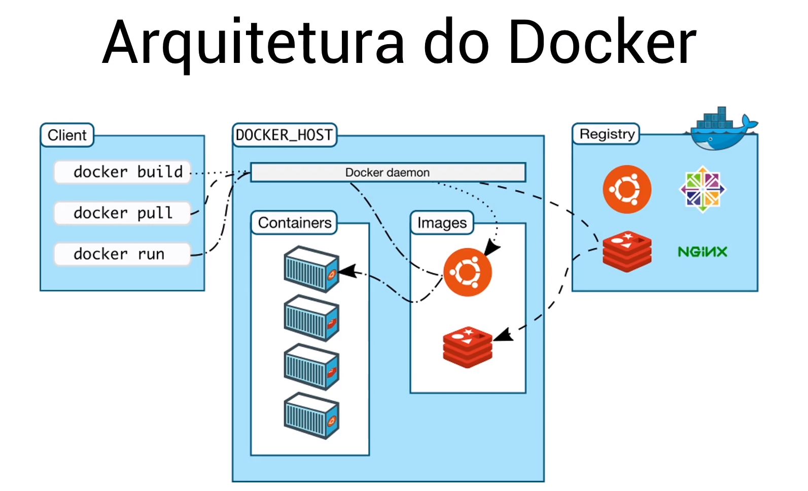

# Modulo 7 - Docker Introducao

## Arquitectura do Docker

* Docker Client - cli interface para executar comandos docker (docker build/pull/run);
* DOCKER_HOST -
  * Docker Daemon - Responsável por gerir os objectos do Docker (Containers, Imagens, Volumes, Redes). Client executa um comando no docker daemon, que orquestra a execução desse comando;
* Docker Registry - Repositório de imagens docker (Docker HUB, Nexus)



## Comandos Docker

```bash
docker container run <image_NAME>:<tag>
```

Comando para executar um container a partir de uma imagem.

Workflow:
    1º Docker verifica se a imagem já está em cache na máquina local
        * Se sim, usa a cache para ler a imagem;
        * Se não, vai ao Docker registry baixar a imagem;
    2º Executa um container baseado nas instruções da imagem

```bash
docker container ls
```
Mostra só os containers que estao ativos, ou seja, que estao em execução

```bash
docker container ls -a
```
Mostra todos os containers mesmo os que já nao estão em execução

```bash
docker container rm <container_ID>
```
Para remover o container

```bash
docker container run -it ubuntu:latest /bin/bash
```
Executar container em modo iterativo, para poder entrar no sistema operativo do container
Bom para debug

```bash
docker container run -d nginx:latest
```
Executar container em modo daemon, para o terminal nao ficar com o cursor parado e o container correr em background.

Podemos depois usar o comando a cima para entrar dentro do container.

```bash
docker exec -it <container_ID> /bin/bash
```
Entrar num container que esteja em execução e habilitar um terminal

**Port Binding**

```bash
docker container run -d -p 8080:80 nginx:latest
```

> Exemplo:
>
>`-p 8080:80` -> Linka o porto 80 do container, ao porto 8080 da máquina local
>                Podemos então aceder ao container através de `http://localhost:8080` e vamos ter acesso à pagina do nginx


