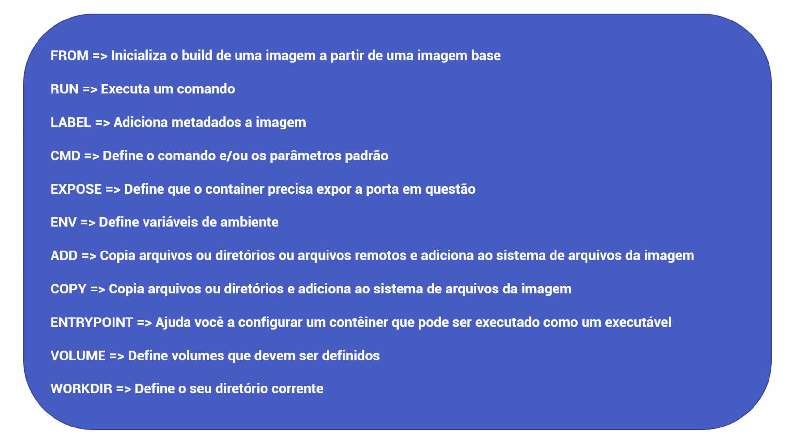

# Módulo 7 - Docker first module

## Images - Dockerfile

**Imagem vs Container**

Imagem:
    * É o blueprint
    * Desenho do que a aplicação será
    * Prepara a estrutura para gerar o projecto final
    * A imagem por si só um conjunto de instruções, que não estão em execução

Container:
    * É o produto final baseado na estrutura de uma imagem
    * Executa as instruções dadas pela imagem e cria o produto final
    * O container ao ser executado, gera uma instância da aplicação que será executada num servidor (Aqui temos um processo a rodar que surgiu através da imagem inicial)

**Imagem**

```bash
bpvcode/app-backend:v1`
```
    * `bpvcode` - namespace (A quem pertence o repositório - registry)
    * `appX-backend` - repositório (Nome do repositório - tipo git)
    * `v1` - tag, versão da imagem

    > NOTA:
    > Se uma imagem nao tiver namespace, significa que é uma imagem oficial, ou seja, faz parte do repositório do docker.

**Como criar imagens docker**

* docker commit - **NÃO RECOMENDADO**
* Dockerfile

## Dockerfile

```Dockerfile
FROM ubuntu

RUN apt-get update && apt-get install --yes curl

#Test that curl is installed
RUN curl
```

O Dockerfile funciona como a receita para a construção da imagem, essa imagem será posteriormente executada por um container.

Criar a imagem a partir de um Dockerfile:

```bash
docker build -t bpvcode/ubuntu-curl:build .
```

* O docker, no processo de build das imagens utiliza cache, onde vê quais as alterações que foram feitas ao Dockerfile.
* Se não existirem alterações, o processo de build é muito rápido pois reutiliza o que tem em cache.
* A cache é utilizada até à ultima instrução que anteceda a linha mudada no Dockerfile.

```bash
docker container run -it bpvcode/ubuntu-curl:build /bin/bash

# Output:
# root@3b55c84f0aaf:/#
```

Cria um container e fornece um terminal bash para interagir com o container, que neste caso tem o sistema operativo ubuntu com o curl instalado. Ver [**Dockerfile**](Dockerfile)

**NOTAS:**
* O Dockerfile pode ser armazenado e versionado num repositório git;
* O Dockerfile pode ser executado numa pipeline CI/CD (baixa a imagem e cria a aplicação).

## Criação de um Dockerfile

Criação de um [Dockerfile](api-conversão/Dockerfile) para aplicação [api-conversão](api-conversão).

> NOTAS:
>
> P: Porquê primeiro copiar o `package.json` e o `package-lock.json` fazer o npm install e só depois copiar tudo?
>
> R: Para otimizar camadas, se não, qualquer arquivo (neste caso o `index.js`) que fosse alterado, iria sempre executar o > `npm install`. Nós só queremos executar o `npm install` se mudar o `package.json` ou o `package-lock.json`.

**Workflow para executar a aplicação num container**

1º - Criar imagem a partir do Dockerfile:

```bash
docker build -t bpvcode/api-conversao:1.78 .
```

2º - Executar o container a partir da imagem criada:

```bash
docker container run -d -p 8080:8080 bpvcode/api-conversao:1.78

# -d - modo daemon (background)
# -p - port-forwarding
```

3º - Aceder a `http://localhost:8080/api-docs`, deve entrar no swagger e pode então interagir com a API - FIM

NOTA:
É boa pratica sempre que criarmos uma nova imagem, criar tambem o latest

```bash
bpvcode/api-conversao:1.78
bpvcode/api-conversao:latest
```

## Principais instruções para criação de imagens Docker



NOTA:

* ENTRYPOINT - Executa no start do container, e pode ser através de um ficheiro executável. Muito usado em conjunto com o CMD, pois o ENTRYPOINT executa o comando de inicialização, e o CMD serve para poder passar parâmetro opcionais para o ENTRYPOINT.