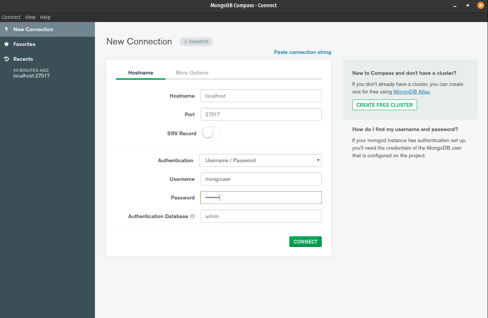
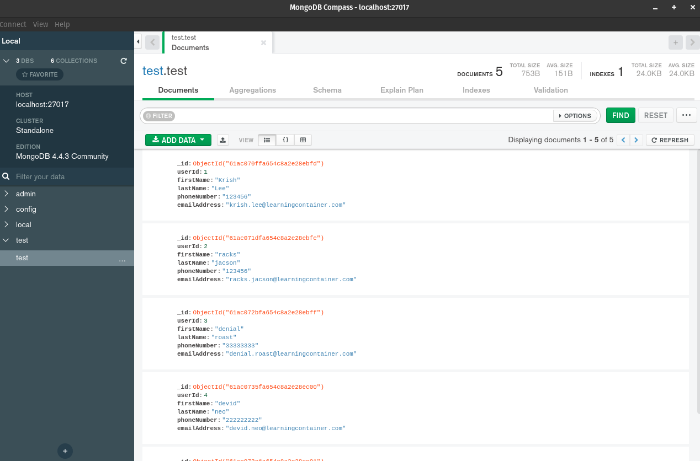

# Exercise 1

"Execute os comandos para criar os 4 bancos de dados listados com containers, e use como se tivesse instalado eles localmente na sua máquina (Não esquece de garantir que não vai perder os dados caso o container seja excluido).
- MongoDB
- MariaDB
- PostgreSQL
- Redis" - kubedev community exercises

## Mongo

### Create a docker volume. Docker will manage a folder in host filesystem where to store the same data as the container

```bash
docker volume create mongo_vol
```

### Running a mongo instance in docker container and mount the directory `/data/db` inside container to the path managed by docker in host filesystem. Fin this path by run `docker inspect mongo_vol`.

```bash
docker run --name mongodb -d \
    -e MONGO_INITDB_ROOT_USERNAME="mongouser" \
    -e MONGO_INITDB_ROOT_PASSWORD="mongopwd" \
    -v mongo_vol:/data/db \
    -p 27017:27017 \
    mongo:4.4.3
```

### Connect the container with MongoDB Compass



### Add random sample data to database



### Check that container has the same data as mongo compass. Find in `/data/db` path

```bash
docker exec -it mongodb /bin/bash
```

### NOTE:

Remove docker container:

```bash
docker rm -f mongodb
```

Refresh MongoDB Compass:


Restart mongodb container with the same volume:

```bash
docker run --name mongodb -d \
    -e MONGO_INITDB_ROOT_USERNAME="mongouser" \
    -e MONGO_INITDB_ROOT_PASSWORD="mongopwd" \
    -v mongo_vol:/data/db \
    -p 27017:27017 \
    mongo:4.4.3
```

Refresh MongoDB Compass - Check that we have the same data although the container has been deleted and restarted:

