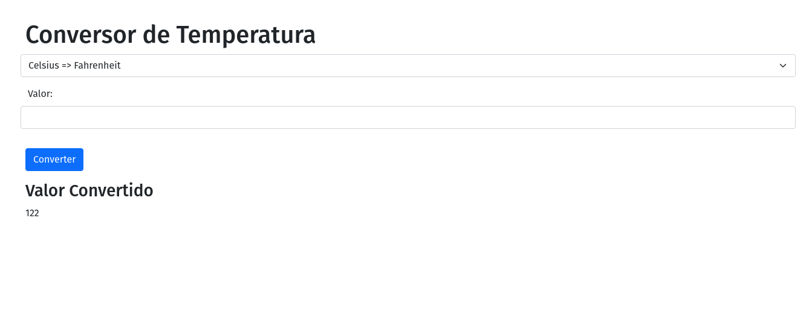
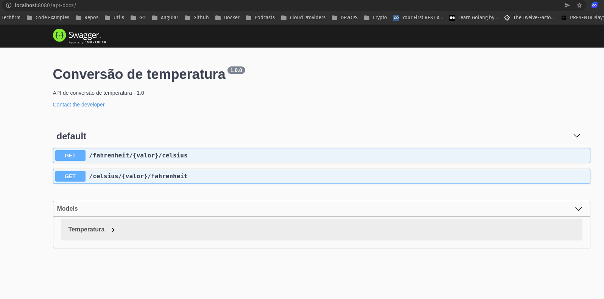

# NODEJS APP - Conversão de Temperatura

Build the image (Run this command in `/src` folder):

```bash
docker build . -t bpvcode/node-web-app:1
```

Run the image:

```bash
docker run -p 8080:8080 -d bpvcode/node-web-app:1
```

Print app output:

```bash
docker logs <container id>
```

Enter the container:

```bash
docker exec -it <container id> /bin/bash
```




