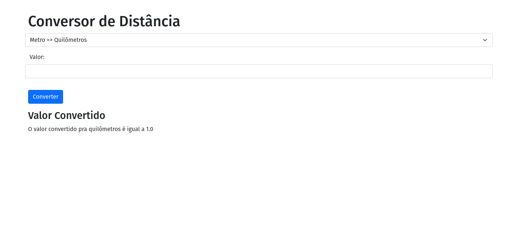

# PYTHON USING FLASK APP - Conversão Distâncias

[Dockerfile added](Dockerfile)

Build the image (Run this command in `/conversao-distancia` folder):

```bash
docker build . -t bpvcode/python-flask-app:1
```

Run the image:

```bash
docker run -p 5000:5000 -d bpvcode/python-flask-app:1
```

NOTE:
By default, Flask runs on port 5000 in development mode.

App:


