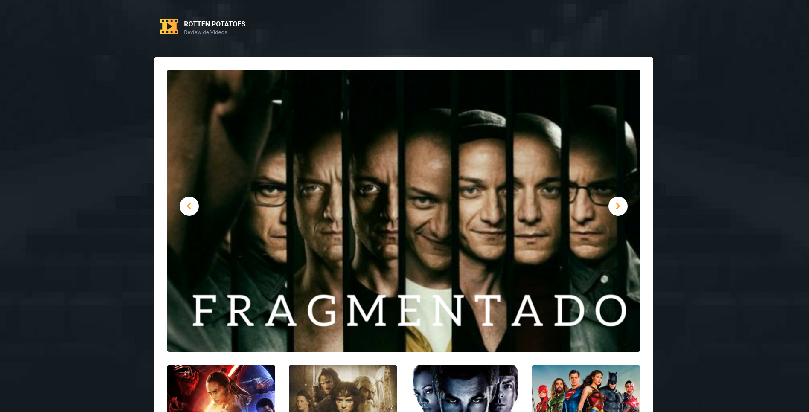

# Rotten-potatoes app

NOTE: Need docker login first

Build image:

```bash
docker build . -t bpvcode/potatoes-app:v1
```

Push image to personal docker hub repo:

```bash
docker push bpvcode/potatoes-app:v1
```

Run containers:

```bash
docker-compose up -d
```

Docker compose:

- 1º Create volume and network
- 2º Create mongo db container with volume
- 3º Create app container from previous build image
  - will fetch the image from `bpvcode/potatoes-app` repo, version `:v1`
  - Port binding

[Go to App](<http://localhost:5000>)



## Configuração

MONGODB_DB => Nome do database

MONGODB_HOST => Host do MongoDB

MONGODB_PORT => Porto de acesso ao MongoDB

MONGODB_USERNAME => User do MongoDB

MONGODB_PASSWORD => Pass do MongoDB
