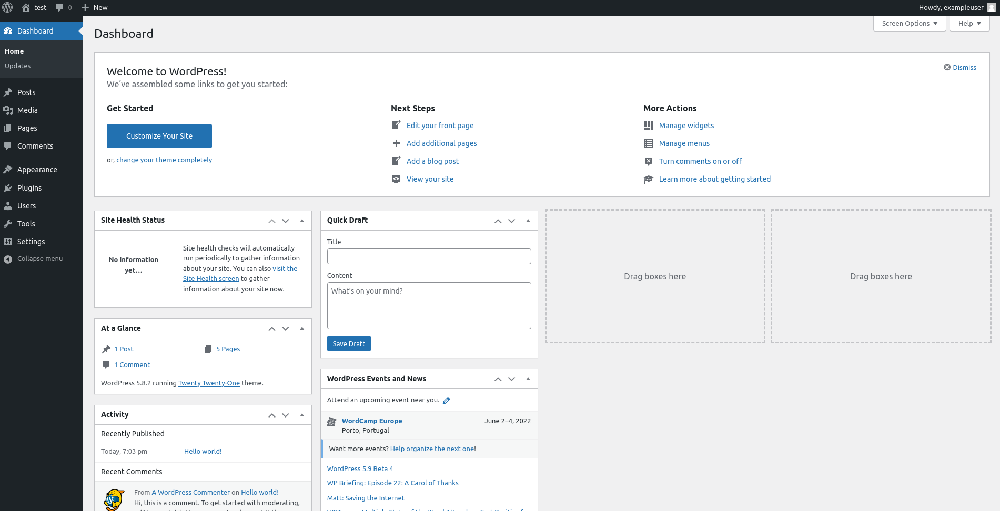

# Wordpress docker environment

Run containers:

```bash
docker-compose up -d
```

Docker compose:

- 1º Create volume and network
- 2º Create mysql container with volume
- 3º Create wordpress container

[Go to App](<http://localhost:8080>)


