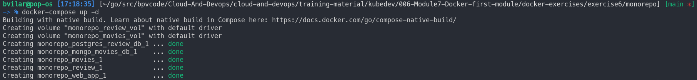
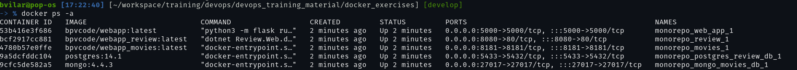
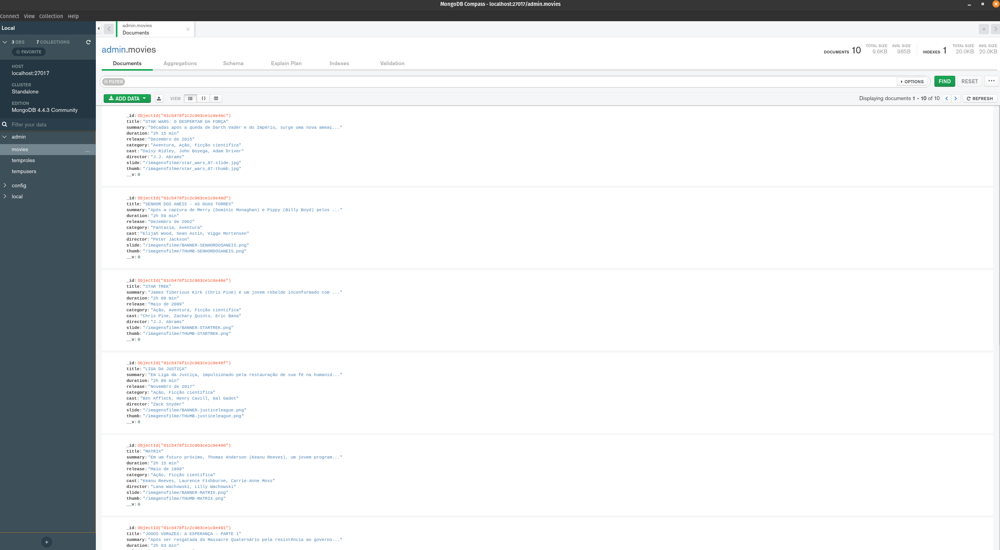
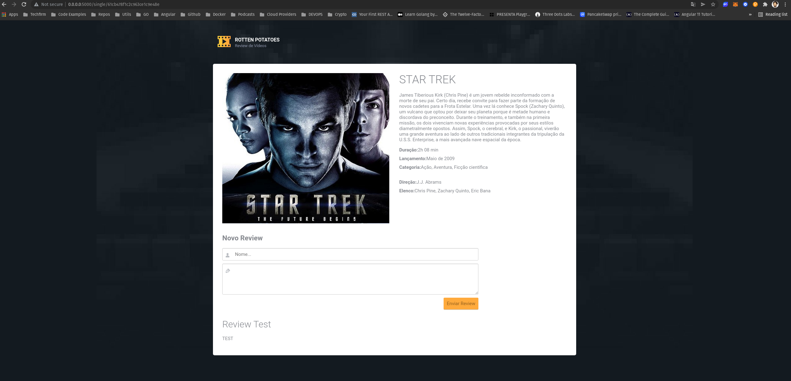
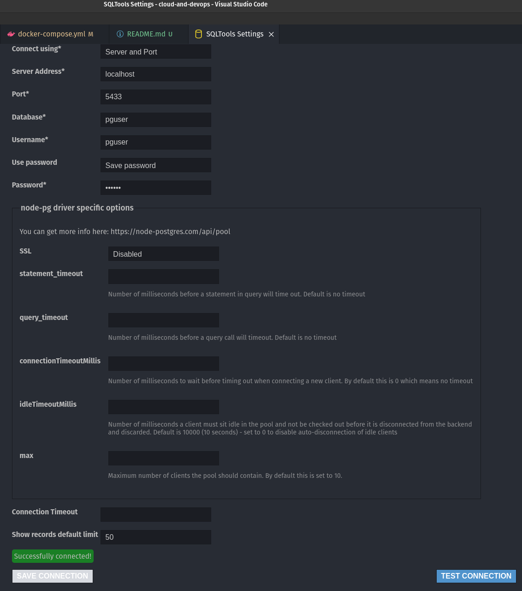
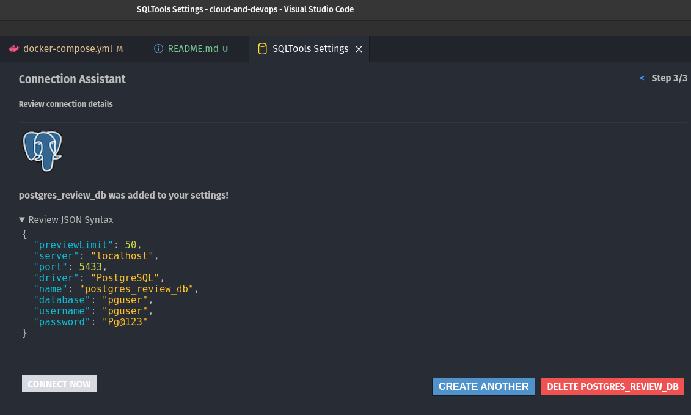
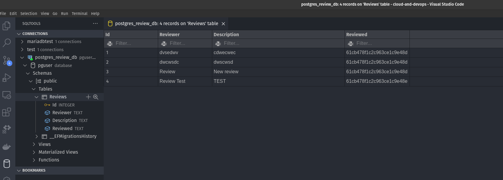

# Exercise 6

6 - "Agora vamos aumentar mais a complexidade das coisas, chegou a hora de executar uma aplicação baseada em arquitetura de microsserviços. Essa aplicação é formada por 3 repositórios:

- [Aplicação Web](web_app)
- [Microsserviço de Filmes](movies_service)
- [Microsserviço de Avaliação](review_service)

Montar o ambiente com Docker compose baseado em arquivos de enviroment." - kubedev community exercises

## Workflow explain

Dockerfiles added:

- [Movie service](movies_service/src/Dockerfile)
- [Review service](review_service/src/Review.Web/Dockerfile)
- [Web App](web_app/src/Dockerfile)

Docker compose added:

- [Docker compose](docker-compose.yml)

**Run application:**

```bash
docker-compose up -d
```

Output:



Docker compose explain:

- 1º Create volume and network
- 2º Build images and use them to run containers for `review`, `movies` and `web_app` services
- 3º Create connection between `web_app` and `movies` and `review` containers
  - `movie` service connects to `mongodb` database container
  - `review` service connects to `postgres` database container
  - `web_app` service connects to `movie` service to manage all movie data hosted in `mongodb`
  - `web_app` service connects to `review` service to manage all reviews data hosted in `postgres`

**Check container creation:**

```bash
docker ps -a
```

Output:



## [Go to App](<http://0.0.0.0:5000/>):

Movies test:


Movies database test:



Review test:



Reviews database test:






