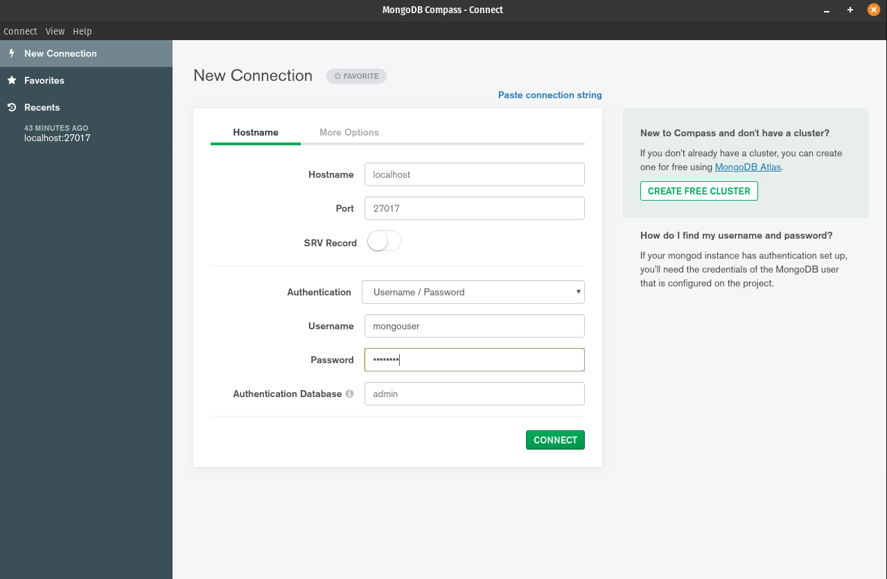
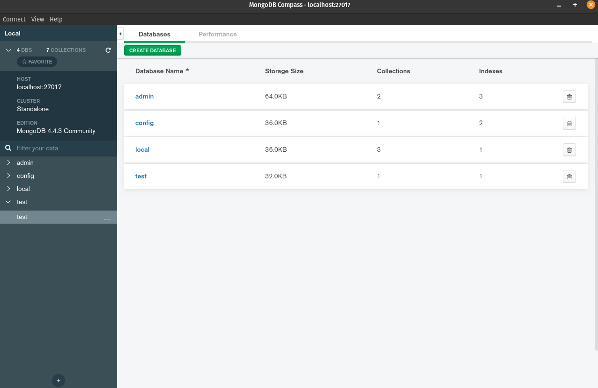
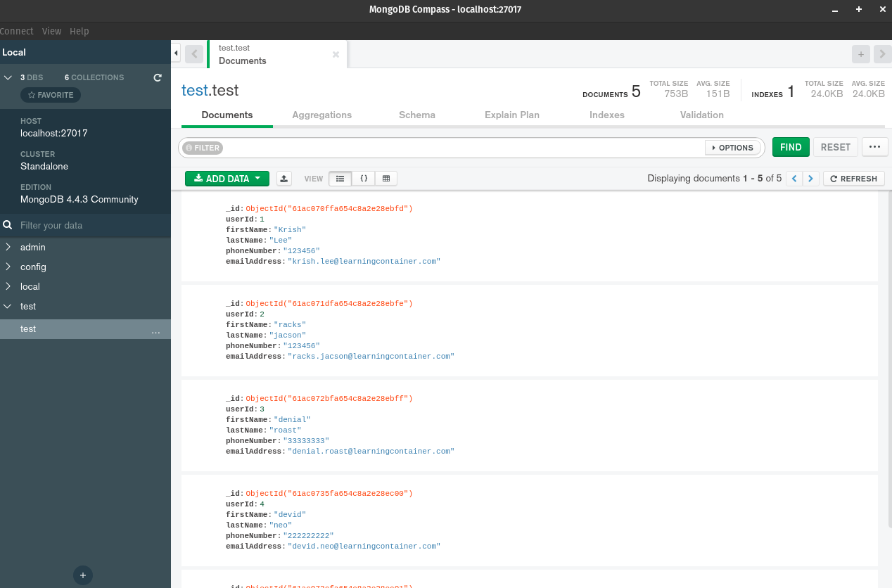
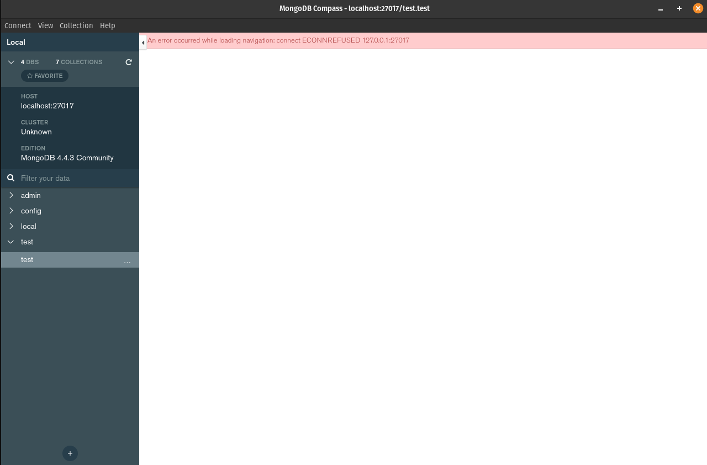

# Mongo

NOTE: Exercise 2 using MongoDB Compass instead Mongo Express

1 - Create a docker volume. Docker will manage a folder in host filesystem where to store the same data as the container

```bash
docker volume create mongo_vol
```

2 - Running a mongo instance in docker container and mount the directory `/data/db` inside container to the path managed by docker in host filesystem. Fin this path by run `docker inspect mongo_vol`

```bash
docker run --name mongodb -d \
    -e MONGO_INITDB_ROOT_USERNAME="mongouser" \
    -e MONGO_INITDB_ROOT_PASSWORD="mongopwd" \
    -v mongo_vol:/data/db \
    -p 27017:27017 \
    mongo:4.4.3
```

3 - Connect the container with MongoDB Compass



Add random sample data to database




4 - Check that container has the same data as mongo compass. Find in `/data/db` path

```bash
docker exec -it mongodb /bin/bash
```

**NOTE:**

5 - Remove docker container

```bash
docker rm -f mongodb
```

6 - Refresh MongoDB Compass



7 - Restart mongodb container with the same volume

```bash
docker run --name mongodb -d \
    -e MONGO_INITDB_ROOT_USERNAME="mongouser" \
    -e MONGO_INITDB_ROOT_PASSWORD="mongopwd" \
    -v mongo_vol:/data/db \
    -p 27017:27017 \
    mongo:4.4.3
```

8 - Refresh MongoDB Compass - Check that we have the same data although the container has been deleted and restarted


## Conclusion

We create a mongo instance, based on a docker container, and we mount the volume data to the host filesystem. We used a MongoDB Compass client to interact with our database and we persist all data through docker volumes.