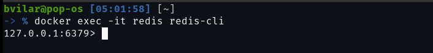
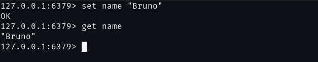

# Redis

1 - Create a docker volume. Docker will manage a folder in host filesystem where to store the same data as the container

```bash
docker volume create redis_vol
```

2 - Running a redis instance in docker container and mount the directory `/data` inside container to the path managed by docker in host filesystem. Fin this path by run `docker inspect redis_vol`

```bash
docker run --name redis -d \
    -v redis_vol:/data \
    -p 6379:6379 \
    redis:6.2
```

3 - Exec container with Redis CLI





4 - Check that container has the same data as Redis CLI. Find in `/data` path

```bash
docker exec -it mariadb /bin/bash
```

## Conclusion

We create a mariadb instance, based on a docker container, and we mount the volume data to the host filesystem. We used Redis CLI to interact with our database and we persist all data through docker volumes.